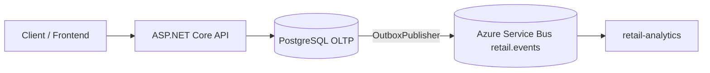

# Retail Inventory API

[](https://github.com/elvarlax/retail-inventory/actions)

Retail Inventory API is a backend-focused project built with **ASP\.NET Core (.NET 10)** and **PostgreSQL**.

The project demonstrates layered architecture, event-driven design via the transactional outbox pattern, transactional domain logic, pagination, sorting, JWT-based authentication, role-based authorization, structured logging, repository abstraction, automated test coverage, and Dockerized infrastructure — reflecting real-world backend engineering practices.

---

# Architecture

## Application Layers

Controller → Service → Repository → DbContext → PostgreSQL

* Controllers handle HTTP concerns only (routing, status codes, request/response shaping)
* Services encapsulate domain logic and enforce business invariants
* Repositories abstract query and persistence logic
* Entity Framework Core manages database access and migrations
* PostgreSQL stores operational data

SQLite (in-memory) is used during automated tests to provide a fast relational test environment.

---

## System Architecture

The service also acts as an **event producer** in a broader event-driven data platform architecture.



This architecture enables reliable event-driven integration with downstream systems without requiring distributed transactions.

Events produced by this service are consumed by the **retail-analytics** project to build an analytics warehouse.

---

# Event-Driven Architecture — Transactional Outbox Pattern

Every domain mutation writes an event to an `outbox_messages` table in the **same database transaction** as the state change.

A background service (`OutboxPublisher`) polls the table and publishes unpublished messages to an **Azure Service Bus topic**.

### Event Pipeline

```
API
 ↓
PostgreSQL (outbox_messages)
 ↓
OutboxPublisher
 ↓
Azure Service Bus Topic
 ↓
retail-analytics consumer
 ↓
events.retail_events
 ↓
dbt transformations
 ↓
analytics tables
```

---

## Events Emitted

| Event                  | Trigger                                       |
| ---------------------- | --------------------------------------------- |
| `CustomerCreatedV1`    | `POST /auth/register` or seed                 |
| `ProductCreatedV1`     | `POST /api/products` or seed                  |
| `OrderPlacedV1`        | `POST /api/orders`                            |
| `OrderStatusChangedV1` | `POST /api/orders/{id}/complete` or `/cancel` |

---

## OutboxPublisher Behaviour

* Polls every **3 seconds** for unpublished messages
* Sends **batches of up to 20 messages**
* **Exponential backoff** on failure (5s × attempt, capped at 60s)
* `published_at_utc` is stamped only after confirmed send

Local development uses the **Azure Service Bus Emulator** running inside Docker.

---

# Authentication & Authorization

The API uses **JWT Bearer authentication**.

* Token-based authentication using a symmetric signing key
* Role-based authorization (Admin / User)
* Protected endpoints via `[Authorize]`
* Swagger UI with JWT support

### Default Seeded Credentials

| Role  | Email       | Password  |
| ----- | ----------- | --------- |
| Admin | admin@local | Admin123! |
| User  | user@local  | User123!  |

Endpoints:

```
POST /auth/login
POST /auth/register
```

Register also emits `CustomerCreatedV1`.

---

# Domain Overview

## Products

* Unique constraint on `SKU`
* DTO projection via AutoMapper
* Pagination and sorting support
* Emits `ProductCreatedV1`

Endpoints:

```
POST /api/products
GET /api/products
GET /api/products/{id}
```

---

## Customers

* Unique constraint on `Email`
* DTO projection via AutoMapper
* Pagination and sorting support

Endpoints:

```
GET /api/customers
GET /api/customers/{id}
```

---

## Orders

The **Order aggregate** contains the core business logic.

Features:

* Transactional order creation
* Stock deduction during order placement
* Stock restoration on cancel
* State transitions

```
Pending → Completed
Pending → Cancelled
```

Events emitted:

* `OrderPlacedV1`
* `OrderStatusChangedV1`

Endpoints:

```
POST /api/orders
GET /api/orders
GET /api/orders/{id}
GET /api/orders/summary
POST /api/orders/{id}/complete
POST /api/orders/{id}/cancel
```

---

# Admin — Data Seeding

Generates realistic test data using **Bogus**.

Events emitted during seeding:

* `CustomerCreatedV1`
* `ProductCreatedV1`
* `OrderPlacedV1`
* `OrderStatusChangedV1`

Endpoint:

```
POST /admin/seed
```

Example body:

```
{
  "customers": 1000,
  "products": 1000,
  "orders": 5000
}
```

---

# Pagination, Filtering & Sorting

Orders support:

* `pageNumber`
* `pageSize`
* `status`
* `sortBy`
* `sortDirection`

Example:

```
GET /api/orders?pageNumber=1&pageSize=10&status=Completed
GET /api/products?pageNumber=1&pageSize=10&sortBy=price&sortDirection=desc
```

---

# Structured Logging

Uses **Serilog** with:

* structured logs
* request logging middleware
* environment-based configuration

---

# Transaction Handling

Order creation is wrapped in a database transaction covering:

* Stock deduction
* Order persistence
* Order items persistence
* Outbox event insertion

All succeed together or none are committed.

---

# Performance

* Eliminates N+1 queries
* Batch product lookups
* Indexed query paths
* `AsNoTracking()` on read queries
* Indexed `outbox_messages.published_at_utc`

---

# Testing Strategy

## Unit Tests

* SQLite in-memory provider
* Domain rule validation
* Pagination coverage

## Integration Tests

* `WebApplicationFactory`
* Full HTTP pipeline
* Isolated database per test
* Outbox event verification

---

# Running Locally

### Prerequisites

* Docker
* Docker Compose
* .NET 10 SDK

---

## Start the Stack

```
docker-compose up --build -d
```

Swagger:

```
http://localhost:8080/swagger
```

---

## Seed Data

```
POST /admin/seed
```

---

## Run Tests

```
dotnet test
```

---

# Docker

Runs:

* API
* PostgreSQL
* Azure Service Bus Emulator
* SQL Edge

Startup order:

1. `sqledge`
2. `servicebus`
3. `postgres`
4. `api`

---

# Tech Stack

* .NET 10
* ASP\.NET Core Web API
* Entity Framework Core
* PostgreSQL (Npgsql)
* Azure Service Bus
* Azure Service Bus Emulator
* SQLite (testing)
* AutoMapper
* Bogus
* BCrypt\.Net
* Serilog
* xUnit + FluentAssertions
* Docker
* GitHub Actions

---

# Input Validation

DTO validation via `[ApiController]`.

Examples:

* Email validation on login
* Quantity validation on order items
* Seed limits on admin endpoint

---

# Design Principles

* Business logic lives in services
* Repositories isolate persistence
* Transactions protect aggregate invariants
* Outbox ensures reliable event publishing
* DTOs decouple API contracts
* Tests validate both domain rules and HTTP behaviour
* Infrastructure adapts to environment
* Read queries use `AsNoTracking()` for efficiency