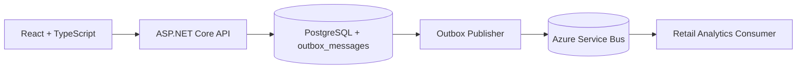

# Retail Inventory

[](https://github.com/elvarlax/retail-inventory/actions/workflows/dotnet-ci.yml)

Retail Inventory is a full-stack portfolio project built with **ASP\.NET Core (.NET 10)**, **PostgreSQL**, and **React + TypeScript**. It focuses on practical backend engineering patterns: Clean Architecture, CQRS-style reads and writes, JWT auth, API versioning, transactional outbox messaging, Dockerized infrastructure, and automated testing.

## Highlights

- Clean Architecture with vertical slices in the Application layer
- EF Core for writes, Dapper for read models
- Transactional outbox pattern with Azure Service Bus publishing
- JWT authentication with role-based authorization
- Admin dashboard with order summary and top products
- Unit, integration, and NBomber load tests

## Architecture

Dependency flow:

```text
Api -> Application -> Domain
Api -> Infrastructure -> Application -> Domain
```

Project structure:

```text
src/
|-- RetailInventory.Domain
|-- RetailInventory.Application
|-- RetailInventory.Infrastructure
|-- RetailInventory.Api
`-- RetailInventory.Web
tests/
`-- RetailInventory.Tests
```

## System Architecture



## Eventing

The project uses the **transactional outbox pattern**. When customers, products, or orders are created or updated, an event is written to `outbox_messages` in the same transaction as the business change. A background service then publishes unpublished messages to Azure Service Bus.

Events emitted include:

- `CustomerCreatedV1`
- `ProductCreatedV1`
- `OrderPlacedV1`
- `OrderStatusChangedV1`

## API Surface

Main capabilities:

- authentication: `POST /auth/login`, `POST /auth/register`
- products: create, list, detail, update, restock, delete
- customers: create, list, detail, update, delete
- orders: place, list, detail, complete, cancel, delete
- admin: seed data, order summary, top products

List endpoints support pagination, sorting, and search where appropriate.

## Local Run

Prerequisites:

- Docker + Docker Compose
- .NET 10 SDK

Start the stack:

```bash
docker compose up --build -d
```

Main URLs:

- Web UI: `http://localhost:3000`
- Swagger: `http://localhost:8080/swagger`

Seeded credentials:

| Role | Email | Password |
|---|---|---|
| Admin | admin@local | Admin123! |
| User | user@local | User123! |

## Testing

Run the regular test suite:

```bash
dotnet test --filter "Category!=LoadTest"
```

Run the load test separately:

```bash
dotnet test --filter "Category=LoadTest"
```

## Postman

The included `retail-inventory.postman_collection.json` covers:

- auth flows
- product/customer/order CRUD
- admin seed and secret routes
- order summary and top-products endpoints

Set `baseUrl` to your running API and log in first so the collection stores the bearer token automatically.

## Tech Stack

| Category | Technology |
|---|---|
| Backend | .NET 10, ASP\.NET Core |
| Data | EF Core, Dapper, PostgreSQL |
| Frontend | React, TypeScript, Vite |
| Messaging | Azure Service Bus |
| Auth | JWT Bearer |
| Testing | xUnit, FluentAssertions, NBomber |
| Infrastructure | Docker, Docker Compose, Nginx |
